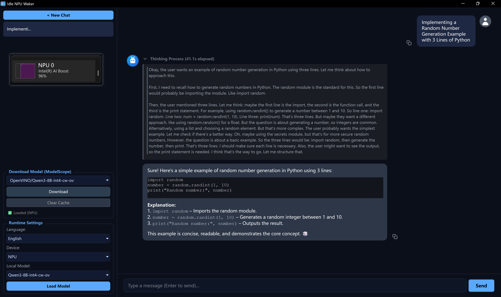

# Idle NPU Waker

**Idle NPU Waker** 是一个基于 **Python** 与 **PyQt6**
构建的现代化本地 AI 聊天客户端。应用深度集成 **Intel OpenVINO™ GenAI**
工具链，专为配备 Intel Core Ultra（Meteor Lake / Lunar Lake）等具备
**NPU（神经网络处理单元）** 的 AI PC
优化，带来低延迟、低功耗的完全离线大模型推理体验。



------------------------------------------------------------------------

## 核心特性

### 极致本地加速

-   原生支持 Intel **NPU**、iGPU（Intel Arc）与 CPU 推理。
-   基于 OpenVINO GenAI C++ Runtime 绑定，性能优异。

### 一站式模型管理

-   内置 **魔搭社区（ModelScope）** 下载器。
-   支持 **断点续传**、暂停、取消下载。
-   下载后自动整理目录，无需手动解压或配置。
-   实时监控模型目录变动，导入即时生效。

### 现代化交互体验

-   **流式对话**（打字机效果，实时生成）。
-   **多会话管理**：新建、保存历史、右键删除。
-   **富文本渲染**：Markdown、代码高亮（部分支持）。
-   **人性化设计**：气泡式 UI、一键复制消息、可调侧栏宽度。

### 开箱即用

-   可通过 PyInstaller 打包为独立 `.exe` 程序，无需安装 Python 环境。

------------------------------------------------------------------------

## 环境要求

-   **操作系统**：Windows 10 / 11（推荐），Linux
-   **Python**：3.10 -- 3.12
-   **硬件要求**：
    -   推荐：Intel Core Ultra 系列（集成 NPU），Intel Arc GPU
    -   兼容：任意支持 AVX2 的 x86_64 处理器

------------------------------------------------------------------------

## 安装与开发运行

### 1. 克隆仓库

``` bash
git clone https://github.com/FangAiden/Idle-NPU-Waker.git
cd Idle-NPU-Waker
```

### 2. 安装依赖

建议使用虚拟环境（`venv` 或 `conda`）避免依赖冲突：

``` bash
# 创建虚拟环境
python -m venv venv

# 激活环境（Windows PowerShell）
.\venv\Scripts\activate

# 安装依赖
pip install -r requirements.txt
```

> **requirements.txt 关键依赖**： - `PyQt6` -
> `openvino-genai >= 2024.2.0` - `modelscope` - `huggingface_hub`

### 3. 启动应用

务必从项目根目录执行：

``` bash
python main.py
```

------------------------------------------------------------------------

## 使用指南

### 1. 下载模型

-   在左侧 **"下载模型（魔搭社区）"** 区域进行操作。
-   **预设模型**：下拉框提供常用的 OpenVINO 量化模型（Qwen2.5、Llama3.1
    等）。
-   **手动输入**：支持输入 ModelScope 模型 ID。
-   点击 **"下载"** 开始获取模型，可随时 **暂停 /
    取消**，再次下载可断点续传。

### 2. 加载模型

-   在左侧 **"运行设置"** 区域选择推理设备：`NPU`（推荐）、`GPU` 或
    `CPU`。
-   下载完成后，模型会自动出现在下拉列表中。
-   点击 **"加载模型"**，右侧提示"模型已就绪"代表成功加载。

### 3. 开始对话

-   在右下角输入框输入内容，按 **Enter** 发送（`Shift + Enter` 换行）。
-   点击 **"停止"** 随时中断推理。
-   点击左上角 **"+ 新建对话"** 创建新的会话。
-   在左侧会话列表中 **右键删除** 历史会话。

------------------------------------------------------------------------

## 项目结构

``` text
Idle-NPU-Waker/
├── main.py                  # 入口程序
├── models/                  # 模型目录（自动生成）
├── .download_temp/          # 下载缓存目录
├── app/
│   ├── config.py            # 全局配置
│   ├── core/                # 核心逻辑
│   │   ├── llm_worker.py    # LLM 推理线程（QThread）
│   │   ├── downloader.py    # 下载进程控制（QProcess）
│   │   ├── download_script.py # 独立运行的下载脚本
│   │   └── runtime.py       # OpenVINO Runtime 封装
│   ├── ui/                  # 界面组件
│   │   ├── chat_window.py   # 主界面逻辑
│   │   ├── sidebar.py       # 左侧栏
│   │   ├── message_bubble.py# 聊天气泡
│   │   └── resources.py     # 图标资源
│   └── utils/               # 工具函数
│       ├── scanner.py       # 模型目录扫描
│       └── styles.py        # QSS 样式表
└── requirements.txt
```

------------------------------------------------------------------------

## 打包发布（EXE）

项目已针对 PyInstaller 做多进程兼容。

### 1. 安装 PyInstaller

``` bash
pip install pyinstaller
```

### 2. 执行打包（Windows）

``` powershell
python -m PyInstaller --noconsole --onefile --name "Idle_NPU_Waker" --add-data "app;app" --collect-all openvino_genai --collect-all openvino --collect-all modelscope main.py
```

### 3. 运行

-   打包完成后，在 `dist/` 下获得 `Idle_NPU_Waker.exe`。
-   双击即可运行（首次启动会自动创建 `models` 目录）。

------------------------------------------------------------------------

## 致谢

-   **推理引擎**：Intel OpenVINO™ Toolkit\
-   **模型来源**：魔搭社区（ModelScope）\
-   **界面框架**：PyQt6

------------------------------------------------------------------------

## 许可证

GPLv3 License
