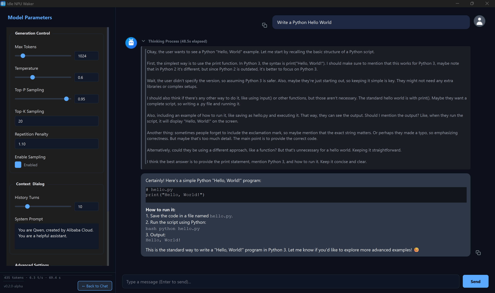
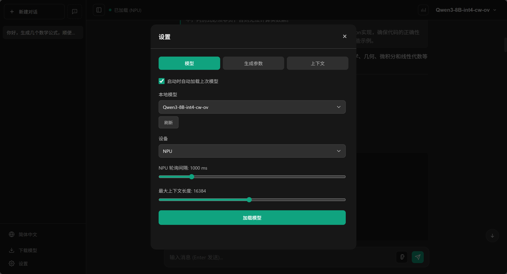

# Idle NPU Waker

**简体中文** | [English](README_en.md)

**Idle NPU Waker** 是一个基于 **Python** 的本地 AI 聊天客户端，提供 Web UI。
应用整合 **Intel OpenVINO GenAI**，面向具备 NPU 的 AI PC，实现低延迟本地推理，并支持 CPU/GPU 回退。

> **新特性：** 推理模型输出中的 `<think>` 会显示在可折叠的思考面板中。





---

## 功能亮点

- **多设备推理：** NPU / GPU / CPU 自动回退。
- **模型管理：** 本地扫描、ModelScope 下载；基于 `generation_config.json` 与 `app/model_settings.json` 自动解析支持的设置项。
- **欢迎页流程：** 必须加载模型后才能进入对话，顶部支持模型切换。
- **流式对话：** 实时输出、临时对话、编辑/重试/复制。
- **富文本渲染：** Markdown、Mermaid、KaTeX 数学公式。
- **性能面板：** tokens/s、模型内存、下载状态、可拖动 NPU 监控（系统支持时生效）。
- **文件附件：** 支持文本文件上传，单文件 512 KB。

---

## ModelScope 下载示例

在下载面板中可直接粘贴任意 ModelScope 模型仓库 ID。示例：

- `OpenVINO/Qwen3-8B-int4-cw-ov`
- `OpenVINO/DeepSeek-R1-Distill-Qwen-1.5B-int4-cw-ov`
- `OpenVINO/DeepSeek-R1-Distill-Qwen-7B-int4-cw-ov`
- `OpenVINO/Phi-3.5-mini-instruct-int4-cw-ov`
- `OpenVINO/Mistral-7B-Instruct-v0.2-int4-cw-ov`
- `OpenVINO/Phi-3-mini-4k-instruct-int4-cw-ov`
- `OpenVINO/Mistral-7B-Instruct-v0.3-int4-cw-ov`
- `OpenVINO/gpt-j-6b-int4-cw-ov`
- `OpenVINO/falcon-7b-instruct-int4-cw-ov`

---

## 环境要求

- **操作系统：** Windows 10 / 11（推荐）、Linux
- **Python：** 3.10 - 3.12
- **关键依赖：**
  - `openvino >= 2025.1.0`
  - `openvino-genai >= 2025.1.0`
  - `openvino-tokenizers >= 2025.1.0`
  - `modelscope`
  - `fastapi`, `uvicorn`

---

## 安装与运行

### 1. 克隆仓库

```bash
git clone https://github.com/FangAiden/Idle-NPU-Waker.git
cd Idle-NPU-Waker
```

### 2. 安装依赖

```bash
python -m venv venv
.\venv\Scripts\activate
pip install -r requirements.txt
```

### 3. 使用 Tauri 开发运行（推荐）

```bash
cargo tauri dev
```

`cargo tauri dev` 会自动启动 Python 后端并加载内嵌 UI。  
如需指定 Python 解释器，可设置环境变量 `IDLE_NPU_PYTHON`。

### 3.1 仅后端/浏览器运行（可选）

```bash
python main.py
```

或：

```bash
python backend/server.py
```

浏览器打开 `http://127.0.0.1:8000`，API 路径为 `/api`。

> 安装版默认把模型与缓存存放在 `%LOCALAPPDATA%\IdleNPUWaker`（可通过环境变量 `IDLE_NPU_DATA_DIR` 指定）。

### 4. 打包桌面安装包（Tauri）

需要先安装：
- Rust 工具链（`rustup`）
- Tauri CLI：`cargo install tauri-cli`

执行打包：

```bash
python build.py
```

`build.py` 会先用 PyInstaller 生成后端 EXE，再调用 `cargo tauri build` 生成安装包。

加速提示：如果后端未改动，可执行 `python build.py --skip-backend`；如果仅后端更新，可用 `python build.py --skip-tauri` 先生成 EXE。

---

## 项目结构

```text
Idle-NPU-Waker/
├─ main.py                  # Web 入口
├─ build.py                 # PyInstaller 打包脚本（可选）
├─ backend/                 # FastAPI 后端 + NPU 监控
├─ frontend/                # Web UI 静态资源
├─ models/                  # 模型目录（自动生成）
├─ .download_temp/          # 下载缓存
├─ app/
│  ├─ config.py             # 全局配置
│  ├─ core/                 # OpenVINO 运行时与推理线程
│  ├─ utils/                # 扫描与工具
│  └─ model_settings.json   # 模型设置项规则
└─ requirements.txt
```

---

## 许可证

GPLv3 License
